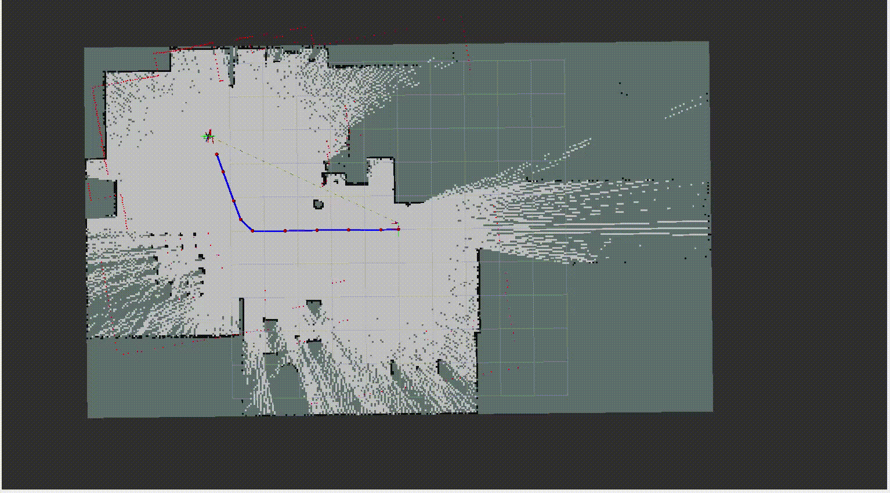
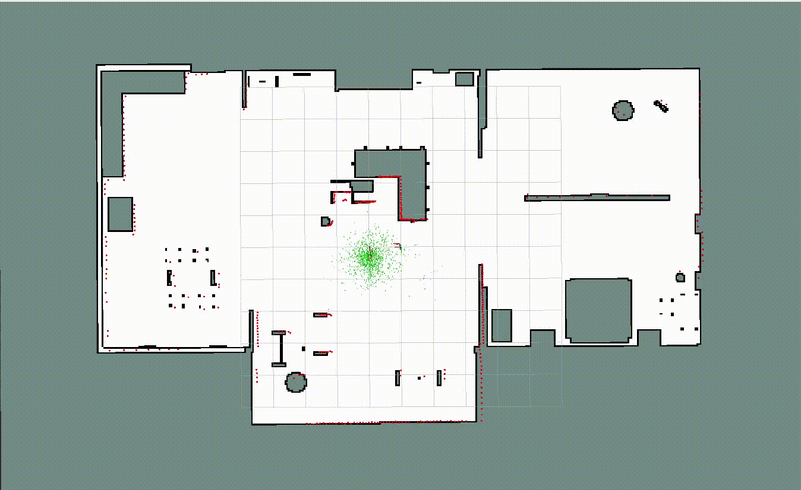
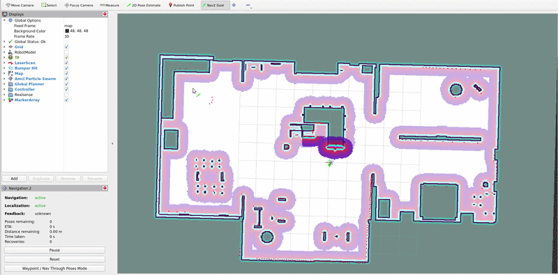

# 🤖 BumperBot — ROS 2 Autonomous Mobile Robot


A complete **ROS 2 Humble** autonomous mobile robot platform featuring differential drive control, SLAM mapping, AMCL localization, and Nav2 autonomous navigation.

This repository is based on **BumperBot**, an open-source ROS 2 mobile robot originally developed by **Antonio Brandi**:
👉 https://github.com/AntoBrandi/Bumper-Bot

---

## 📋 Table of Contents

- [Overview](#-overview)
- [Features](#-features)
- [Project Structure](#-project-structure)
- [Prerequisites](#-prerequisites)
- [Installation](#-installation)
- [Usage](#-usage)
  - [Simulation Mode](#simulation-mode)
  - [Real Robot Mode](#real-robot-mode)
- [Navigation Demo](#-navigation-demo)
- [Package Descriptions](#-package-descriptions)
- [Configuration](#-configuration)
- [Acknowledgments](#-acknowledgments)

---

## 🔍 Overview

BumperBot is a low-cost, 3D-printed, self-driving robot designed as a learning and development platform for ROS 2. This repository provides a complete implementation including:

- **URDF/Xacro robot description** with Gazebo simulation support
- **Differential drive control** using ros2_control
- **SLAM mapping** for environment exploration
- **AMCL localization** on prebuilt maps
- **Nav2 autonomous navigation** with path planning and obstacle avoidance
- **Joystick teleoperation** support
- **Real hardware interface** for physical robot deployment

Based on the original [BumperBot by Antonio Brandi](https://github.com/AntoBrandi/Bumper-Bot).

---

## ✨ Features

| Feature | Description |
|---------|-------------|
| **Simulation** | Full Gazebo simulation with sensors (LiDAR, IMU) |
| **SLAM** | Online mapping using slam_toolbox |
| **Localization** | AMCL-based localization with robot_localization EKF sensor fusion |
| **Navigation** | Nav2 stack with Regulated Pure Pursuit controller and SMAC 2D planner |
| **Custom Planners** | Custom Dijkstra and A* global planners |
| **Custom Controllers** | Custom PD Motion Planner and Pure Pursuit controllers |
| **Control** | Differential drive controller with velocity limits |
| **Teleoperation** | Joystick control via joy_teleop |
| **Hardware** | Real robot support with MPU6050 IMU driver |

---

## 📁 Project Structure

```
ros2_bumperbot/
├── bumperbot_bringup/        # Main launch files for simulation & real robot
├── bumperbot_controller/     # Differential drive & velocity controllers
├── bumperbot_description/    # URDF/Xacro, meshes, Gazebo worlds
├── bumperbot_firmware/       # Hardware interface & IMU driver
├── bumperbot_localization/   # AMCL & EKF localization
├── bumperbot_mapping/        # SLAM & map management
├── bumperbot_motion/         # Motion planning utilities
├── bumperbot_navigation/     # Nav2 configuration & launch
├── bumperbot_planning/       # Path planning components
├── bumperbot_utils/          # Utility nodes and tools
└── docs/                     # Documentation and media
```

---

## 📦 Prerequisites

### System Requirements
- **Ubuntu 22.04 LTS**
- **ROS 2 Humble Hawksbill**

### ROS 2 Dependencies

```bash
sudo apt update
sudo apt install -y \
    ros-humble-gazebo-ros-pkgs \
    ros-humble-ros2-control \
    ros-humble-ros2-controllers \
    ros-humble-xacro \
    ros-humble-robot-state-publisher \
    ros-humble-joint-state-publisher-gui \
    ros-humble-slam-toolbox \
    ros-humble-navigation2 \
    ros-humble-nav2-bringup \
    ros-humble-robot-localization \
    ros-humble-twist-mux \
    ros-humble-joy \
    ros-humble-joy-teleop
```

---

## 🛠️ Installation

### 1. Create a ROS 2 Workspace

```bash
mkdir -p ~/ros2_ws/src
cd ~/ros2_ws/src
```

### 2. Clone the Repository

```bash
git clone https://github.com/Jasser000/ros2_bumperbot.git
```

### 3. Install Dependencies

```bash
cd ~/ros2_ws
rosdep install --from-paths src --ignore-src -r -y
```

### 4. Build the Workspace

```bash
colcon build --symlink-install
```

### 5. Source the Workspace

```bash
source ~/ros2_ws/install/setup.bash
```

> **Tip:** Add the source command to your `~/.bashrc` for convenience:
> ```bash
> echo "source ~/ros2_ws/install/setup.bash" >> ~/.bashrc
> ```

---

## 🚀 Usage

### Simulation Mode

#### Launch Full Simulation with Localization (AMCL)

```bash
ros2 launch bumperbot_bringup simulated_robot.launch.py
```

This launches:
- Gazebo simulation with BumperBot
- Differential drive controller
- Joystick teleoperation
- AMCL localization
- Nav2 navigation stack
- RViz2 visualization

#### Launch Simulation with SLAM Mapping

```bash
ros2 launch bumperbot_bringup simulated_robot.launch.py use_slam:=true
```

Use this mode to create a new map of your environment.

#### Save a Map (after SLAM)

```bash
ros2 run nav2_map_server map_saver_cli -f ~/maps/my_map
```

---

### Real Robot Mode

#### Launch Real Robot

```bash
ros2 launch bumperbot_bringup real_robot.launch.py
```

This launches:
- Hardware interface with serial communication
- MPU6050 IMU driver
- Differential drive controller
- Joystick teleoperation

> **Note:** Ensure the robot's microcontroller is connected and the serial port is correctly configured.

---

## 🎬 Demos

### 🗺️ Mapping Mode (SLAM)



*BumperBot performing online SLAM and building a 2D occupancy grid map in simulation.*

### 📍 Localization Mode (AMCL)



*BumperBot localizing itself using AMCL on a prebuilt map, visualized in RViz.*

### 🧭 Autonomous Navigation



*BumperBot autonomously navigating to goal positions using Nav2, avoiding obstacles and following planned paths.*

### Demo Features Shown:
- **Goal setting** via RViz2 "2D Goal Pose" tool
- **Path planning** with global and local planners
- **Obstacle avoidance** using LiDAR sensor data
- **Smooth trajectory following** with Regulated Pure Pursuit controller

---

## 📦 Package Descriptions

| Package | Description |
|---------|-------------|
| **bumperbot_bringup** | Top-level launch files for simulation and real robot deployment |
| **bumperbot_controller** | Differential drive controller, simple velocity controller, and joystick teleop |
| **bumperbot_description** | Robot URDF/Xacro model, meshes, RViz configs, and Gazebo worlds |
| **bumperbot_firmware** | Hardware interface for ros2_control and MPU6050 IMU driver |
| **bumperbot_localization** | AMCL configuration and EKF sensor fusion with robot_localization |
| **bumperbot_mapping** | SLAM configuration using slam_toolbox and map storage |
| **bumperbot_motion** | Custom Nav2 controllers: PD Motion Planner and Pure Pursuit |
| **bumperbot_navigation** | Nav2 stack configuration (controller, planner, behavior servers) |
| **bumperbot_planning** | Custom Nav2 global planners: Dijkstra and A* |
| **bumperbot_utils** | Utility nodes and helper tools |

---

## ⚙️ Configuration

### Controller Parameters

Key parameters in `bumperbot_controller/config/bumperbot_controllers.yaml`:

| Parameter | Value | Description |
|-----------|-------|-------------|
| `wheel_radius` | 0.033 m | Wheel radius |
| `wheel_separation` | 0.17 m | Distance between wheels |
| `max_velocity` (linear) | 1.0 m/s | Maximum forward speed |
| `max_velocity` (angular) | 1.7 rad/s | Maximum rotation speed |
| `max_acceleration` (linear) | 0.8 m/s² | Linear acceleration limit |

### Navigation Parameters

Navigation configuration files are located in `bumperbot_navigation/config/`:

- `controller_server.yaml` - Local trajectory controller (Regulated Pure Pursuit)
- `planner_server.yaml` - Global path planner (SMAC 2D)
- `behavior_server.yaml` - Recovery behaviors
- `bt_navigator.yaml` - Behavior tree navigator
- `smoother_server.yaml` - Path smoothing
- `costmap.yaml` - Costmap configuration

### Custom Plugins

This project includes custom Nav2 plugins:

**Global Planners** (`bumperbot_planning`):
- `DijkstraPlanner` - Classic Dijkstra shortest path algorithm
- `AStarPlanner` - A* heuristic-based path planning

**Local Controllers** (`bumperbot_motion`):
- `PDMotionPlanner` - PD control-based trajectory following
- `PurePursuit` - Pure Pursuit path tracking algorithm

To use custom plugins, modify the config files (commented examples provided).

---

## 🙏 Acknowledgments

This project is based on **BumperBot** by [Antonio Brandi](https://github.com/AntoBrandi/Bumper-Bot), an excellent educational platform for learning ROS 2 robotics.

Featured in the Udemy courses:
- *Self Driving and ROS 2 – Learn by Doing! Odometry & Control*
- *Self Driving and ROS 2 – Learn by Doing! Map & Localization*
- *Self Driving and ROS 2 - Learn by Doing! Plan & Navigation*

---

<p align="center">
  <b>Happy Robot Building! 🤖</b>
</p>